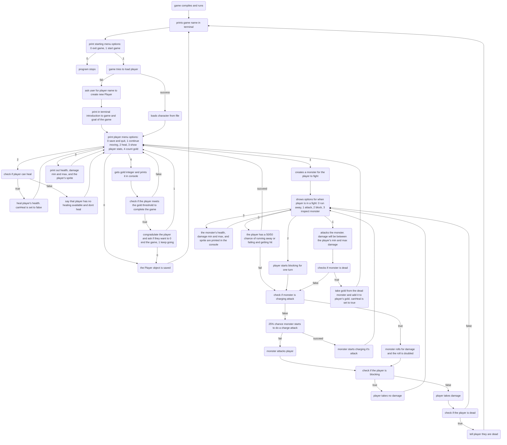

# Monster-Slayer-Flowchart

```mermaid
graph TD
    run(game compiles and runs) --> mainMenu(prints game name in terminal)
    mainMenu --> mainMenuOptions(print starting menu options: 0 exit game, 1 start game)
    mainMenuOptions --> |0| stopGame(program stops)
    mainMenuOptions --> |1| loadPlayer(game tries to load player)
    loadPlayer --> |fail| createPlayer(ask user for player name to create new Player)
    createPlayer --> playIntro(print in terminal introduction to game and goal of the game)
    loadPlayer --> |success| loadCharacter(loads character from file)
    playIntro --> playerMenuOptions(print player menu options: 0 save and quit, 1 continue moving, 2 heal, 3 show player stats, 4 count gold)
    loadCharacter --> playerMenuOptions
    playerMenuOptions --> |0| saveGame(the Player object is saved)
    playerMenuOptions --> |1| createMonster(creates a monster for the player to fight)
    playerMenuOptions --> |2| healCheck(check if player can heal)
    playerMenuOptions --> |3| showPlayerStats(print out health, damage min and max, and the player's sprite)
    playerMenuOptions --> |4| showGold(gets gold integer and prints it in console)
    saveGame --> mainMenu
    showPlayerStats --> playerMenuOptions
    healCheck --> |true| heal(heal player's health. canHeal is set to false)
    heal --> playerMenuOptions
    healCheck --> |false| dontHeal(say that player has no healing available and dont heal)
    dontHeal --> playerMenuOptions
    showGold --> checkForGoldThreshold(check if the player meets the gold threshold to complete the game)
    checkForGoldThreshold --> |false| playerMenuOptions
    checkForGoldThreshold --> |true| meetGoldThreshold(congradulate the player and ask if they want to 0 end the game, 1 keep going)
    meetGoldThreshold --> |0| saveGame
    meetGoldThreshold --> |1| playerMenuOptions
    createMonster --> playerFightOptions(shows options for when player is in a fight: 0 run away, 1 attack, 2 block, 3 inspect monster)
    playerFightOptions --> |0| tryToRun(the player has a 50/50 chance of running away or failing and getting hit)
    playerFightOptions --> |1| attackMonster(attacks the monster. damage will be between the player's min and max damage)
    playerFightOptions --> |2| block(player starts blocking for one turn)
    playerFightOptions --> |3| printMonster(the monster's health, damage min and max, and sprite are printed in the console)
    printMonster --> playerFightOptions
    tryToRun --> |succeed| playerMenuOptions
    tryToRun --> |fail| monsterStartsAttack(check if monster is charging attack)
    monsterStartsAttack --> |true| monsterChargeAttack(monster rolls for damage and the roll is doubled)
    monsterStartsAttack --> |false| monsterFlipForChargeAttack(25% chance monster starts to do a charge attack)
    monsterFlipForChargeAttack --> |succeed| monsterStartsCharging(monster starts charging it's attack)
    monsterStartsCharging --> playerFightOptions
    monsterFlipForChargeAttack --> |fail| monsterAttack(monster attacks player)
    monsterAttack --> checkIfBlocking(check if the player is blocking)
    monsterChargeAttack --> checkIfBlocking
    checkIfBlocking --> |true| noDamage(player takes no damage)
    noDamage --> playerFightOptions
    checkIfBlocking --> |false| takeDamage(player takes damage)
    takeDamage --> checkIfDead(check if the player is dead)
    checkIfDead --> |false| playerFightOptions
    checkIfDead --> |true| playerIsDead(tell player they are dead)
    playerIsDead --> mainMenu
    block --> monsterStartsAttack
    attackMonster --> checkIfMonsterDead(checks if monster is dead)
    checkIfMonsterDead --> |false| monsterStartsAttack
    checkIfMonsterDead --> |true| getGold(take gold from the dead monster and add it to player's gold. canHeal is set to true)
    getGold --> playerMenuOptions
```
